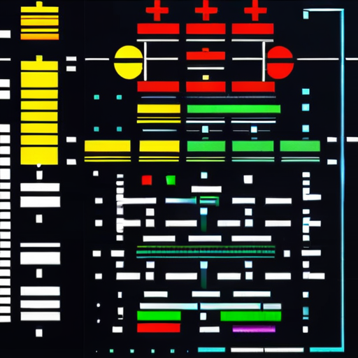
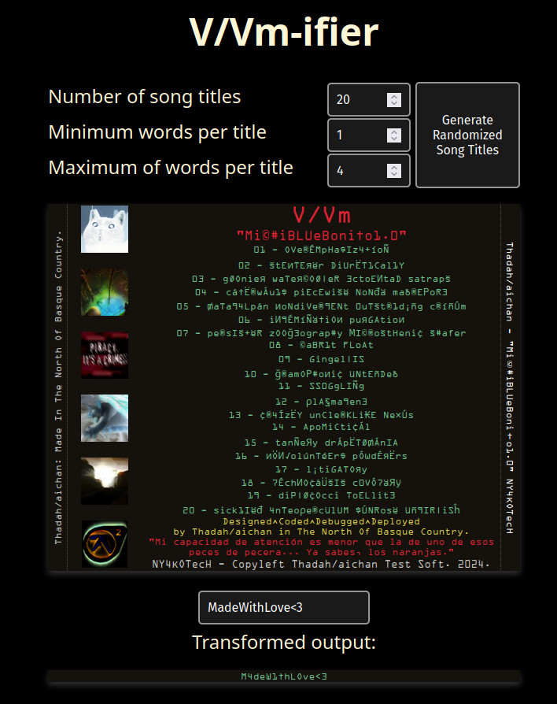

[![Contributors][contributors-shield]][contributors-url]
[![Forks][forks-shield]][forks-url]
[![Stargazers][stars-shield]][stars-url]
[![Issues][issues-shield]][issues-url]
[![EUPL-1.2 License][license-shield]][license-url]


<!-- PROJECT LOGO -->
<br />
<div align="center">
  <a href="https://github.com/thadah/v_vmifier">
    
  </a>

  <h1 align="center">V/Vm-ifier</h1>

  <p align="center">
    A string randomizer inspired by V/Vm HelpAphexTwin4.0 that creates random songlists or transforms any input.
    <br />
    <br />
    <a href="https://github.com/thadah/v_vmifier/issues">Report Bug or </a>
    ·
    <a href="https://github.com/thadah/v_vmifier/issues">Request Feature</a>
  </p>
</div>

<!-- TABLE OF CONTENTS -->
<details>
  <summary>Table of Contents</summary>
  <ol>
    <li>
      <a href="#about-the-project">About The Project</a>
      <ul>
        <li><a href="#built-with">Built With</a></li>
      </ul>
    </li>
    <li>
      <a href="#getting-started">Getting Started</a>
      <ul>
        <li><a href="#prerequisites">Prerequisites</a></li>
        <li><a href="#installation">Installation</a></li>
      </ul>
    </li>
    <li>
      <a href="#serve">Serve</a>
    </li>
    <li>
      <a href="#build">Build</a>
      <ul>
        <li><a href="#trunk">Trunk</a></li>
        <li><a href="#docker">Docker</a></li>
      </ul>
    </li>
    <li><a href="#contributing">Contributing</a></li>
    <li><a href="#license">License</a></li>
    <li><a href="#contact">Contact</a></li>
    <li><a href="#acknowledgments">Acknowledgments</a></li>
  </ol>
</details>


<!-- ABOUT THE PROJECT -->
## About The Project
<div align="center">
    <a href="https://github.com/thadah/v_vmifier">
        
    </a>
</div>

V/Vm-ifier is a string randomizer inspired by V/Vm and the HelpAphexTwin4.0 album, allowing users to generate unique song lists by selecting parameters such as the number of songs and word counts. It outputs these lists with the distinctive aesthetic of the HelpAphexTwin4.0 album and includes a versatile string transformer for manipulating any text input. V/Vm-ifier blends customizable options with random creativity.

<p align="right">(<a href="#readme-top">back to top</a>)</p>


### Built With

This project is built with the following technologies:

- [](#)
- [](#)
- [](#)
- [](#)
- [](#)
- [](#)
- [](#)
- [](#)


<p align="right">(<a href="#readme-top">back to top</a>)</p>


<!-- GETTING STARTED -->
## Getting Started

To get a local copy up and running follow these simple steps.

### Prerequisites

- Rustup and Cargo installed on your local machine
- Git installed on your local machine

### Installation

1. Install the WebAssembly target: `rustup target add wasm32-unknown-unknown`
2. Install Trunk by running `cargo install --locked trunk`
4. Clone the repository to your local machine using the following command: `git clone https://github.com/thadah/v_vmifier.git`
4. Navigate to the project directory: `cd v_vmifier`

<p align="right">(<a href="#readme-top">back to top</a>)</p>

## Serve

Run the following command to start the development server: `trunk serve --open`.

The server will be running at http://localhost:8082, but this can be changed in the `Trunk.toml` file:

```toml
# Configuration for the development server
[serve]
port = 8082
```

<p align="right">(<a href="#readme-top">back to top</a>)</p>


## Build

This service can be built either with Trunk or Docker and can be run in either development mode or production mode.

### Trunk

Run the following command to build the project: `trunk build --release --out-dir dist`

### Docker

#### Dockerfile

To build using the Dockerfile, run the following command: `docker build -t v_vmifier .`

You can then run it with the following command: `docker run -p 80:80 v_vmifier`

#### Docker Compose

To build using the Docker Compose file, run the following command: `docker compose build`

You can then run it with the following command: `docker compose up`


<p align="right">(<a href="#readme-top">back to top</a>)</p>

<!-- CONTRIBUTING -->
## Contributing

Contributions are what make the open source community such an amazing place to learn, inspire, and create. Any contributions you make are **greatly appreciated**.

If you have a suggestion that would make this better, please fork the repo and create a pull request. You can also simply open an issue with the tag "enhancement".
Don't forget to give the project a star! Thanks again!

1. Fork the Project
2. Create your Feature Branch (`git checkout -b feature/AmazingFeature`)
3. Commit your Changes (`git commit -m 'Add some AmazingFeature'`)
4. Push to the Branch (`git push origin feature/AmazingFeature`)
5. Open a Pull Request

<p align="right">(<a href="#readme-top">back to top</a>)</p>


<!-- LICENSE -->
## License

Distributed under the European Union Public License v1.2. See `LICENSE` for more information.

<p align="right">(<a href="#readme-top">back to top</a>)</p>

<!-- CONTACT -->
## Contact

Thadah D. Denyse - thadahdenyse@protonmail.com
Aitor Astorga Saez de Vicuña - a.astorga.sdv@protonmail.com

Project Link: [https://github.com/thadah/v_vmifier](https://github.com/thadah/v_vmifier)

<p align="right">(<a href="#readme-top">back to top</a>)</p>


<!-- ACKNOWLEDGMENTS -->
## Acknowledgments

Many thanks to those who contributed to this project:

* [Aderlyn](https://matrix.to/#/@aderlyn:aroy-art.com): For the original idea 💜
* [Aitor Astorga](https://github.com/AitorAstorga): For creating the frontend for the album based on the original V/Vm HelpAphexTwin4.0 ❤️
* [Leyland James Kirby](https://en.wikipedia.org/wiki/V/Vm): For the music and the album 🎵

Thanks to this awesome projects for their contributions:

* [Trunk](https://trunkrs.dev/)
* [Img Shields](https://shields.io)
* [markdown-badges](https://github.com/Ileriayo/markdown-badges#table-of-contents)

<p align="right">(<a href="#readme-top">back to top</a>)</p>


<!-- MARKDOWN LINKS & IMAGES -->
<!-- https://www.markdownguide.org/basic-syntax/#reference-style-links -->
[contributors-shield]: https://img.shields.io/github/contributors/thadah/v_vmifier.svg?style=for-the-badge
[contributors-url]: https://github.com/thadah/v_vmifier/graphs/contributors
[forks-shield]: https://img.shields.io/github/forks/thadah/v_vmifier.svg?style=for-the-badge
[forks-url]: https://github.com/thadah/v_vmifier/network/members
[stars-shield]: https://img.shields.io/github/stars/thadah/v_vmifier.svg?style=for-the-badge
[stars-url]: https://github.com/thadah/v_vmifier/stargazers
[issues-shield]: https://img.shields.io/github/issues/thadah/v_vmifier.svg?style=for-the-badge
[issues-url]: https://github.com/thadah/v_vmifier/issues
[license-shield]: https://img.shields.io/github/license/thadah/v_vmifier.svg?style=for-the-badge
[license-url]: https://github.com/thadah/v_vmifier/blob/main/LICENSE
